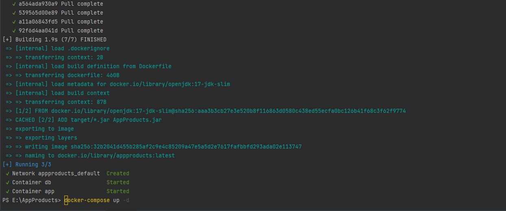
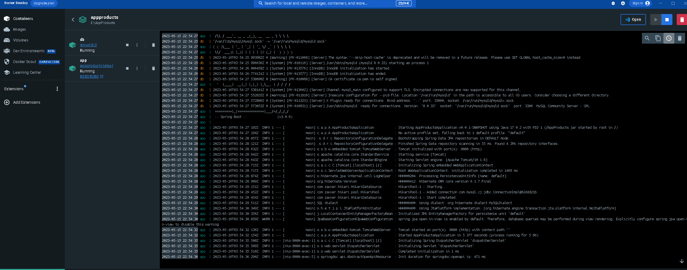
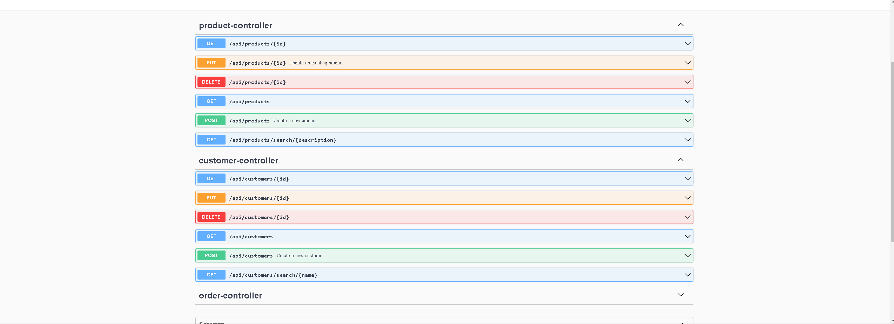
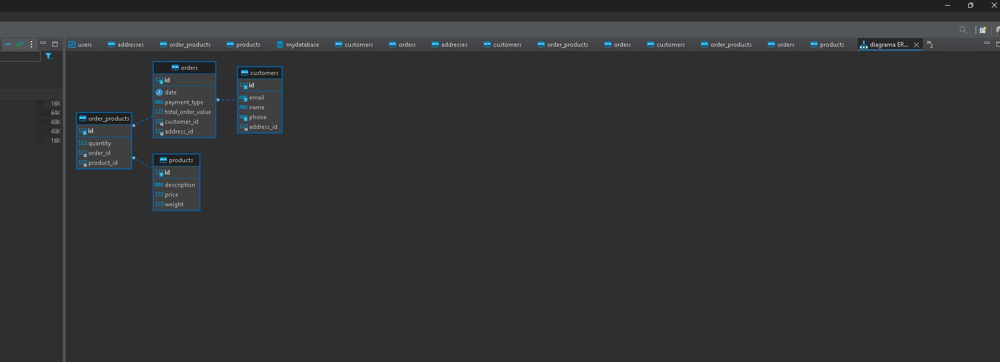
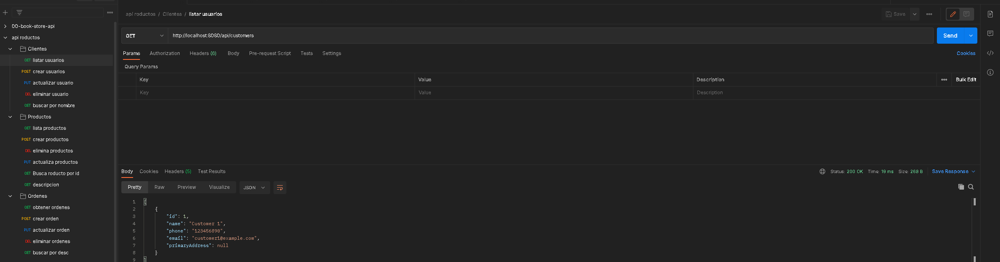
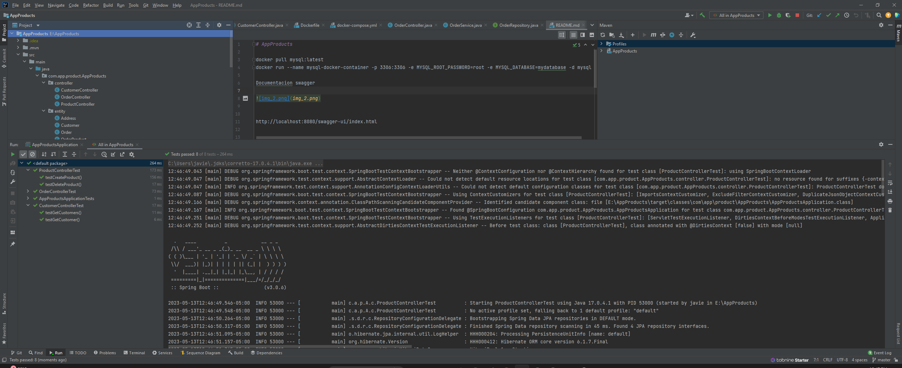
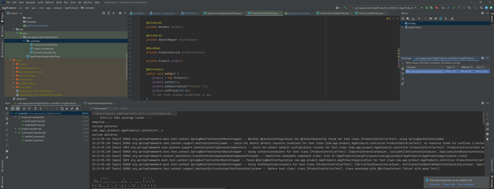

# AppProducts

docker run --name mysql-docker-container -p 3306:3306 -e MYSQL_ROOT_PASSWORD=root -e MYSQL_DATABASE=mydatabase -d mysql

docker pull mysql:latest

Se ajusta para ejecutar app atravez de docker compose 

ejecutar el siguiente comando para generar el jar del projecto.

mvn clean install -DskipTests 

ejecutar el siguiente comando y validar que se generen los contenedores :

docker-compose up -d

Documentacion swagger

http://localhost:8080/swagger-ui/index.html

Diagrama de la base de datos.

collection de postmam 

ejecucion test cases

coverage de los test cases 

